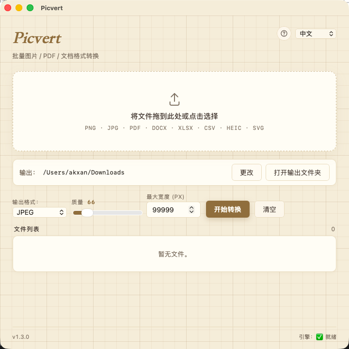

<div align="center">

# 🖼️ Picvert

### Batch image · PDF · Office document converter

#### macOS (Apple Silicon) · Windows · Tauri shell + Python engine · Signed · Notarized · Auto-update

<p>
  
  
  
  
  
</p>

<p>
  
  
  
  
  
  
  
  
</p>

<p>
  
  
  
  
  
  
</p>

<p>
  🇨🇳 <a href="#-中文"><b>中文</b></a> · 🇬🇧 <a href="#-english"><b>English</b></a>
</p>

<p>
  📖 <a href="docs/RELEASING.md"><b>发布手册</b></a> ·
  🐛 <a href="https://github.com/Akxan/picvert/issues/new"><b>报 Bug</b></a> ·
  💡 <a href="https://github.com/Akxan/picvert/issues/new?labels=enhancement"><b>提建议</b></a> ·
  📦 <a href="https://github.com/Akxan/picvert/releases/latest"><b>下载</b></a> ·
  📝 <a href="CHANGELOG.md"><b>更新日志</b></a>
</p>

</div>

---

## 🇨🇳 中文

> 把文件（或整个文件夹）拖进来，选输出格式，点转换。
> 桌面上的悬浮胶囊显示时间和天气，Picvert 安静呆在角落直到你需要。

<p align="center">
  
  &nbsp;&nbsp;
  
</p>

### ✨ 功能亮点

| | |
|---|---|
| 🖼️ **图像格式** | PNG · JPEG · JFIF · BMP · GIF · TIFF · WEBP · ICO · PPM · TGA · JPEG2000 · SVG · **HEIC** （读 + 写） |
| 📄 **PDF → 图像** | 每页 3× 缩放渲染（可调） |
| 📊 **文档互转** | **DOCX ↔ XLSX ↔ CSV** 六向真实转换（多 sheet XLSX → 一个 CSV 一张表） |
| 🎚️ **质量滑块** | JPEG / WEBP / HEIC / JPEG2000 — 60-100，默认 90 |
| 📐 **最大宽度** | 批量按比例缩小大图 |
| 📁 **文件夹拖入** | 递归展开所有支持格式（每次封顶 5000 文件） |
| ⚡ **并行转换** | sidecar 线程池 — 批量比 1.2.x 快 3-4× |
| 🪟 **紧凑模式** | 桌面悬浮天气小部件，点击展开主面板 |
| 🌐 **多语言** | 4 种语言（EN · ES · RU · ZH），托盘菜单同步翻译 |
| 🔄 **自动升级** | 启动后台检查 → 弹原生对话框 → 签名验证后替换重启 |
| ⌨️ **快捷键** | `⌘O` 打开 · `⌘↵` 转换 · `⌘L` 清空 · `⌘.` 取消 |
| 🔍 **点击缩略图** | 用系统默认 app 打开源文件（预览 / Adobe 等） |

### 🚀 下载安装

去 [Releases 页面](https://github.com/Akxan/picvert/releases/latest)：
- **macOS (Apple Silicon)** — `Picvert_*_aarch64.dmg`
- **Windows (x86_64)** — `Picvert_*_x64-setup.exe`

装上之后自动升级 — 下次发新版时启动会弹原生对话框，确认后自动下载替换。

### 🛠️ 本地开发

```bash
git clone https://github.com/Akxan/picvert.git
cd picvert
python3 -m venv .venv && source .venv/bin/activate   # Windows: .venv\Scripts\activate
pip install -e ".[dev]"
pytest -q                                            # 28 tests

# 编译 Python sidecar
python -m PyInstaller engine.spec --clean --noconfirm

# Tauri dev shell（热重载）
cargo install tauri-cli --version "^2.0.0" --locked
cd src-tauri && cargo tauri dev
```

需要：Python 3.10+ · Rust（[rustup](https://www.rust-lang.org/tools/install)）· macOS Xcode CLT / Windows MSVC Build Tools。

---

## 🇬🇧 English

> Drag files (or whole folders) in, choose a format, click Convert.
> A floating capsule on your desktop shows time + weather while Picvert sits out of the way until you need it.

### ✨ Highlights

| | |
|---|---|
| 🖼️ **Images** | PNG · JPEG · JFIF · BMP · GIF · TIFF · WEBP · ICO · PPM · TGA · JPEG2000 · SVG · **HEIC** (read & write) |
| 📄 **PDF → image** | Every page at 3× zoom (configurable) |
| 📊 **Documents** | Real conversion across **DOCX ↔ XLSX ↔ CSV** (six directions) |
| 🎚️ **Quality slider** | JPEG / WEBP / HEIC / JPEG2000 — 60-100, default 90 |
| 📐 **Max-width** | Batch-downscale large images proportionally |
| 📁 **Folder drop** | Recursively expands to all supported files (caps 5000) |
| ⚡ **Parallel** | Sidecar thread pool — ≈3-4× faster batch conversion |
| 🪟 **Compact mode** | Draggable always-on-top weather widget; click to expand |
| 🌐 **i18n** | 4 languages (EN · ES · RU · ZH) — tray menu translates too |
| 🔄 **Auto-update** | Background check + native confirm + signed payload verification |
| ⌨️ **Shortcuts** | `⌘O` open · `⌘↵` convert · `⌘L` clear · `⌘.` cancel |
| 🔍 **Click thumbnail** | Opens source in your default app (Preview / Adobe / etc.) |

### 📦 Download

Grab the latest installer from [Releases](https://github.com/Akxan/picvert/releases/latest):
- **macOS (Apple Silicon)** — `Picvert_*_aarch64.dmg`
- **Windows (x86_64)** — `Picvert_*_x64-setup.exe`

Installed apps auto-update on next launch (signature verified).

---

## 🧬 Architecture · 架构

```
┌─────────────────────────────────────────────────┐
│  Tauri shell  (Rust + WebView)                  │  src-tauri/  +  ui/
│  ─────────────────────────────────────────      │
│  • Main panel · Compact capsule                 │
│  • Menu-bar tray · Native dialogs               │
│  • Auto-updater (minisign verified)             │
│  • Code-signed (Developer ID), notarized        │
└──────────────────┬──────────────────────────────┘
                   │ persistent JSON-RPC over stdio
                   │ (4-thread worker pool)
┌──────────────────▼──────────────────────────────┐
│  picvert-engine  sidecar  (Python --onedir)     │  picvert/
│  ─────────────────────────────────────────      │
│  • Pillow · PyMuPDF · pillow-heif               │
│  • python-docx · openpyxl                       │
│  • Cold start ≈ 0.17 s                          │
└─────────────────────────────────────────────────┘
```

## 🧰 Tech stack · 技术栈

| Layer · 层 | Stack · 选型 |
|---|---|
| **Desktop shell** | [Tauri 2](https://tauri.app/) — Rust + native WebView (WKWebView · WebView2) |
| **Frontend** | Vanilla HTML / CSS / JS — no bundler, no framework |
| **Conversion engine** | Python 3.12 — [Pillow](https://pillow.readthedocs.io) · [PyMuPDF](https://pymupdf.io) · [pillow-heif](https://github.com/bigcat88/pillow_heif) · [python-docx](https://python-docx.readthedocs.io) · [openpyxl](https://openpyxl.readthedocs.io) |
| **Packaging** | PyInstaller `--onedir` (sidecar) + Tauri bundler (shell) |
| **Code signing** | Apple Developer ID Application (notarized + stapled) on macOS; minisign-signed updater payloads on both platforms |
| **CI / Release** | GitHub Actions — build · sign · notarize · publish · manifest |
| **Testing** | pytest — 28 tests across all converter paths |

## 📐 Document conversion matrix · 文档转换矩阵

```
target →     DOCX   XLSX   CSV
DOCX           ✓¹     ✓     ✓
XLSX           ✓      ✓¹    ✓²
CSV            ✓      ✓     ✓¹

¹ same-format → file copy
² multi-sheet XLSX → one CSV per sheet (no data loss)
```

## 🚢 Release pipeline · 发布流程

See [`docs/RELEASING.md`](docs/RELEASING.md) for the full runbook (secrets, signing, notarization, the PyInstaller framework workarounds, and disaster recovery).

```bash
# Bump pyproject.toml + src-tauri/tauri.conf.json to vX.Y.Z, update CHANGELOG.
git tag -a vX.Y.Z -m "Picvert vX.Y.Z"
git push origin main vX.Y.Z
```

GitHub Actions then runs tests, builds the Python sidecar, repairs PyInstaller framework artifacts, three-pass codesigns the sidecar, builds + signs the Tauri bundle, submits to Apple notarytool, generates `latest.json`, and publishes the GitHub Release.

## 📝 Changelog · 更新日志

See [CHANGELOG.md](CHANGELOG.md).

## ⭐ Star History

<a href="https://www.star-history.com/#akxan/picvert&Date">
  <picture>
    <source media="(prefers-color-scheme: dark)" srcset="https://api.star-history.com/svg?repos=akxan/picvert&type=Date&theme=dark" />
    <source media="(prefers-color-scheme: light)" srcset="https://api.star-history.com/svg?repos=akxan/picvert&type=Date" />
    
  </picture>
</a>

<sub>仓库 0 ⭐ 时显示为平线；点 ⭐ 后图表会画出增长曲线。</sub>

## 📜 License · 许可证

[Apache-2.0](LICENSE).

---

<div align="center">
<sub>Built with <a href="https://tauri.app">Tauri</a> · <a href="https://pyinstaller.org">PyInstaller</a> · <a href="https://pillow.readthedocs.io">Pillow</a> · <a href="https://pymupdf.io">PyMuPDF</a> · <a href="https://www.rust-lang.org">Rust</a> · <a href="https://www.python.org">Python</a></sub>
<br><br>
<sub>Made by <a href="https://github.com/Akxan">Akxan</a> · 2026</sub>
</div>
